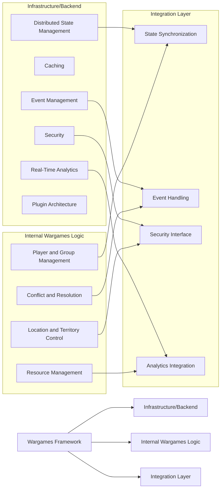
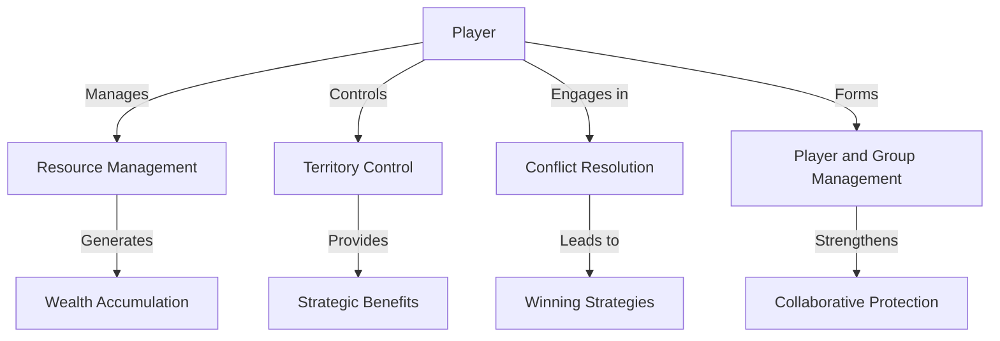
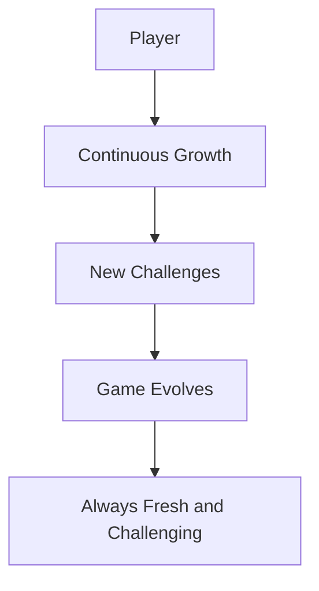

# Wargames Framework (a draft)

Welcome to the **Wargames Framework**! This repository provides a robust, scalable, and modular foundation for building large-scale multiplayer wargames. Whether you're a developer, game designer, or system architect, this framework is designed to be flexible and powerful, supporting a wide range of strategic game scenarios.

## 🚀 Overview

The Wargames Framework focuses on:
- **Scalability**: Distributed state management to handle large numbers of players efficiently.
- **Modularity**: Clear separation of concerns across different components, making the system easy to extend and maintain.
- **Security**: Robust authentication and authorization mechanisms to ensure fair play.
- **Strategic Depth**: Dynamic resource management, conflict resolution, and territory control to provide a rich strategic experience.

## 📂 Repository Structure

This repository is organized into three main directories, each representing a critical branch of the framework:

1. **Infrastructure/Backend**: 
   - Foundational services that support the game, including distributed state management, caching, security, and event handling.
   - [Detailed Documentation](./infrastructure-backend/README.md)

2. **Internal Wargames Logic**: 
   - Core gameplay mechanics, including player actions, resource management, conflict resolution, and territory control.
   - [Detailed Documentation](./internal-wargames-logic/README.md)

3. **Integration Layer**: 
   - Bridges the infrastructure and game logic, ensuring seamless communication, synchronization, and security enforcement.
   - [Detailed Documentation](./integration-layer/README.md)



## 🔧 Key Components

### Infrastructure/Backend
- **Distributed State Management**: Ensures scalability and fault tolerance by distributing game state across multiple nodes.
- **Caching**: Improves performance by caching frequently accessed data.
- **Security**: Manages roles, permissions, and transaction authentication.
- **Event Management**: Handles complex event processing and notifications.
- **Real-Time Analytics**: Provides insights into system performance and player behavior.
- **Plugin Architecture**: Allows for extensibility without modifying the core system.

### Internal Wargames Logic
- **Player and Group Management**: Handles individual and group dynamics, resource management, and strategic decision-making.
- **Location and Territory Control**: Manages the claiming, defending, and transferring of locations within the game.
- **Conflict and Resolution**: Provides multiple strategies for resolving conflicts, from direct battle to negotiation.
- **Resource Management**: Manages resource generation, accumulation, and trade within the game.

### Integration Layer
- **State Synchronization**: Ensures the game logic is synchronized with the distributed state management system.
- **Event Handling and Notification**: Bridges the communication of events between the game logic and infrastructure.
- **Security Interface**: Enforces access control and transaction authentication within the game logic.
- **Analytics Integration**: Gathers data from the game logic and feeds it into the real-time analytics system.

## 🎮 Game Theory and System Design

The Wargames Framework integrates principles from both game theory and system design to create a balanced and strategic gameplay experience:

- **Strategic Depth**: Encourages players to make thoughtful decisions that affect their resources, alliances, and territorial control.
- **Fairness**: Security mechanisms ensure all players follow the same rules, maintaining a level playing field.
- **Resilience**: Designed with redundancy and fault tolerance to handle failures gracefully, ensuring continuous gameplay.

## 🕹️ Player Experience and Engagement

The Wargames Framework is designed not just as a technical marvel but as an engaging and rewarding experience for players. Here’s what makes the game fun:

### Immersive World and Strategic Challenges

Players are dropped into a vast, evolving world where every decision matters. Whether you're managing resources, forging alliances, or defending your territory, the game is full of strategic depth that keeps players engaged.



### Dynamic Resource Management

Players must balance resource gathering, investing, and trading to maintain and expand their influence. The dynamic resource system rewards players who can adapt to changing circumstances and outmaneuver their opponents.

### Tactical Territory Control

Each location in the game world offers unique strategic advantages. Players must claim, defend, and expand their territories, making tactical decisions that impact their overall success.

### Conflict and Resolution

Wargames aren’t just about brute force. Players can choose from a variety of conflict resolution strategies, from direct battles to diplomatic negotiations, ensuring that every encounter is unique and engaging.

### Social Interaction and Alliances

Forming alliances and working together with other players is key to success. Whether defending a shared territory or pooling resources, collaboration enhances the game’s social dimension and creates opportunities for complex strategies.

### Continuous Growth and Challenge

The framework is designed to keep players constantly engaged, with new challenges emerging as they progress. As players grow stronger and claim more territory, the game evolves to match their skill level, ensuring that the experience remains fresh and challenging.



---

Thank you for exploring the **Wargames Framework**! We’re excited to see what you build with it.


## Global Structure
```
# Entity Layer
Entity (Base Class)
    ├── Player
    │   ├── Variables:
    │   │   ├── player_id: int
    │   │   ├── player_name: str
    │   │   ├── resource_manager: ResourceManager
    │   │   ├── ownership_manager: OwnershipManager
    │   │   ├── access_control: AccessControlManager
    │   │   └── avatar: Avatar
    │   ├── Functions:
    │   │   ├── claim_location(location: Location)
    │   │   ├── engage_in_conflict(conflict: Conflict)
    │   │   ├── form_alliance(with: Player or Group)
    │   │   └── make_decision(decision_type: str)
    └── Group
        ├── Variables:
        │   ├── group_name: str
        │   ├── leader: Player
        │   ├── members: list[Player]
        │   ├── resource_manager: ResourceManager
        │   ├── ownership_manager: OwnershipManager
        │   ├── access_control: AccessControlManager
        ├── Functions:
        │   ├── add_member(player: Player)
        │   ├── make_collective_decision(action: str)
        │   └── engage_in_group_conflict(conflict: Conflict)

# Resource Management
ResourceManager
    ├── Variables:
    │   ├── owner: Player or Group
    │   ├── resources: dict
    ├── Functions:
    │   ├── add_resource(resource_type: str, amount: int)
    │   ├── deduct_resource(resource_type: str, amount: int)
    │   ├── transfer_resources(to: ResourceManager, resource_type: str, amount: int)
    │   └── get_resources()

# Ownership and Territory Control
OwnershipManager
    ├── Variables:
    │   ├── controlled_locations: list[Location]
    │   ├── ownership_history: list[dict]
    ├── Functions:
    │   ├── claim_location(location: Location, owner: Player or Group)
    │   ├── transfer_ownership(location: Location, new_owner: Player or Group)
    │   ├── validate_ownership(location: Location, claimant: Player or Group)
    │   └── get_owned_locations()

# Location Management
Location
    ├── Variables:
    │   ├── coordinates: tuple
    │   ├── terrain: str
    │   ├── resources: dict
    │   ├── owner: Player
    │   ├── defenders: list[Player]
    │   └── challengers: list[Player]
    ├── Functions:
    │   ├── generate_resources()
    │   ├── claim(player: Player)
    │   ├── transfer_ownership(new_owner: Player)
    │   ├── add_defender(player: Player)
    │   ├── add_challenger(player: Player)
    │   ├── resolve_conflict()
    │   └── apply_environmental_effects(conflict: Conflict)

# Conflict and Resolution
Conflict
    ├── Variables:
    │   ├── participants: list[Player]
    │   ├── location: Location
    │   ├── war_declared: bool
    │   ├── schedule_date: str
    │   ├── defense_bonus: int
    │   └── stealth_bonus: int
    ├── Functions:
    │   ├── declare_war()
    │   ├── find_scheduled_date()
    │   ├── resolve_conflict()
    │   └── apply_environmental_effects()
    └── Child:
        └── ConflictChain
            ├── Variables:
            │   ├── conflict: Conflict
            │   └── events: list[Event]
            └── Functions:
                ├── add_event(event: Event)
                └── execute_chain()

# Conflict Resolution Strategy
ConflictResolutionStrategy (Interface)
    ├── Functions:
    │   └── execute(conflict: Conflict)
    └── Concrete Implementations:
        ├── DirectBattleStrategy
        ├── NegotiationStrategy
        └── AllianceStrategy

# Event Handling with Observers
EventManager
    ├── Variables:
    │   ├── observers: list[EventObserver]
    ├── Functions:
    │   ├── add_observer(observer: EventObserver)
    │   ├── remove_observer(observer: EventObserver)
    │   └── notify_observers(event: Event)

# Concrete Observers
ResourceObserver (Implements EventObserver)
    ├── Functions:
    │   └── update(event: Event)

ConflictObserver (Implements EventObserver)
    ├── Functions:
    │   └── update(event: Event)

# Distributed GameState Management
DistributedGameState
    ├── Variables:
    │   ├── state_fragments: dict[Location, GameStateFragment]
    │   ├── peer_nodes: list[PeerNode]
    ├── Functions:
    │   ├── distribute_state(location: Location)
    │   ├── sync_state_with_peers()
    │   └── aggregate_state_fragments()

# Caching Layer
CacheManager
    ├── Variables:
    │   ├── cache_store: dict[Location, CachedState]
    │   ├── cache_expiry: timedelta
    ├── Functions:
    │   ├── get_cached_state(location: Location) -> CachedState
    │   ├── set_cached_state(location: Location, state: CachedState)
    │   ├── invalidate_cache(location: Location)
    │   └── clear_expired_cache()

# Load Balancer for Distributed State Management
LoadBalancer
    ├── Variables:
    │   ├── peer_nodes: list[PeerNode]
    │   ├── load_distribution: dict[PeerNode, int]
    ├── Functions:
    │   ├── distribute_load(location: Location) -> PeerNode
    │   ├── monitor_load()
    │   └── rebalance_load()

# Redundant State Management
RedundantGameState
    ├── Variables:
    │   ├── primary_state: DistributedGameState
    │   ├── replica_states: list[DistributedGameState]
    ├── Functions:
    │   ├── synchronize_replicas(location: Location)
    │   ├── failover(location: Location)
    │   └── verify_consistency()

# Consistency Management
ConsistencyManager
    ├── Variables:
    │   ├── pending_transactions: dict[Location, Transaction]
    ├── Functions:
    │   ├── commit_transaction(transaction: Transaction)
    │   ├── resolve_inconsistencies(location: Location)
    │   └── monitor_eventual_consistency()

# Access Control Manager
AccessControlManager
    ├── Variables:
    │   ├── roles: dict[Player, Role]
    │   ├── permissions: dict[Role, list[Action]]
    ├── Functions:
    │   ├── assign_role(player: Player, role: Role)
    │   ├── check_permission(player: Player, action: Action) -> bool
    │   └── enforce_permissions(action: Action)

# Transaction Authentication
TransactionAuthenticator
    ├── Variables:
    │   ├── valid_tokens: list[str]
    │   └── transaction_logs: list[Transaction]
    ├── Functions:
    │   ├── authenticate_transaction(transaction: Transaction) -> bool
    │   ├── generate_token(player: Player) -> str
    │   └── verify_token(token: str) -> bool

# Complex Event Processor
ComplexEventProcessor
    ├── Variables:
    │   ├── event_patterns: list[EventPattern]
    │   ├── active_events: list[Event]
    ├── Functions:
    │   ├── define_pattern(pattern: EventPattern)
    │   ├── monitor_events()
    │   ├── trigger_response(event: Event)
    │   └── aggregate_event_data()

# Real-Time Analytics
AnalyticsDashboard
    ├── Variables:
    │   ├── metrics: dict[str, float]
    │   ├── player_statistics: dict[Player, dict[str, float]]
    ├── Functions:
    │   ├── collect_metrics()
    │   ├── update_dashboard()
    │   ├── generate_reports()
    │   └── trigger_alerts(metric: str, threshold: float)

# Plugin Manager
PluginManager
    ├── Variables:
    │   ├── plugins: list[Plugin]
    ├── Functions:
    │   ├── load_plugin(plugin: Plugin)
    │   ├── initialize_plugin(plugin: Plugin)
    │   └── execute_plugin_action(action: str)

```